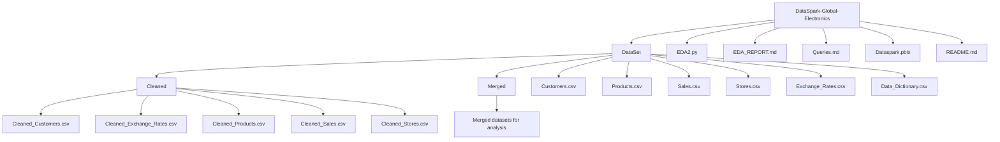

# 📊 DataSpark: Illuminating Insights for Global Electronics

## 🧠 Project Overview
**DataSpark** is an end-to-end **Retail Analytics & Exploratory Data Analysis (EDA)** project developed for **Global Electronics**, a multinational consumer electronics retailer.

The project focuses on analyzing customer, sales, product, store, and currency exchange data to uncover **actionable business insights** that help improve customer satisfaction, optimize operations, and drive revenue growth.

---

## 🎯 Business Objective
To leverage historical retail data to:
- Understand customer demographics and purchasing behavior
- Identify top-performing products, stores, and regions
- Analyze sales trends, seasonality, and profitability
- Evaluate the impact of currency exchange rates on international sales
- Support data-driven strategic decision-making

---

## 🏭 Domain
**Retail Analytics – Consumer Electronics Industry**

---

## 🛠️ Skills & Tools Used
- **Python** – Data Cleaning & Exploratory Data Analysis  
- **SQL (MySQL)** – Business-driven queries and analysis  
- **Power BI** – Interactive dashboards and visual storytelling  
- **Pandas & NumPy** – Data manipulation  
- **Matplotlib / Seaborn** – Visualization  
- **Git & GitHub** – Version control  
- **PEP-8** – Python coding standards  

---

## 📂 Repository Structure (Visual)


---

## 📑 Dataset Description
The project uses multiple structured datasets:

- **Customers.csv** – Customer demographics and geographic data  
- **Sales.csv** – Order-level transaction data  
- **Products.csv** – Product categories, pricing, and costs  
- **Stores.csv** – Store location, size, and opening dates  
- **Exchange_Rates.csv** – Currency conversion rates  
- **Data_Dictionary.csv** – Column-level metadata  

Cleaned datasets are stored in: DataSet/Cleaned/


---

## 🔧 Data Cleaning & Preparation
Performed using **Python (`EDA2.py`)**:
- Handled missing and inconsistent values  
- Converted date and numeric data types  
- Standardized currency-related fields  
- Ensured schema consistency across datasets  
- Generated analysis-ready cleaned CSV files  

---

## 🗄️ SQL Analysis
Business insights were derived using **10+ SQL queries**, including:
- Customer demographic analysis
- RFM (Recency, Frequency, Monetary) segmentation
- Sales trends and seasonality analysis
- Product and category profitability
- Store-wise and country-wise performance
- Currency impact on revenue

📄 SQL queries are documented in: Queries.md

---

## 📊 Exploratory Data Analysis (EDA)
Detailed EDA findings are documented in: EDA_REPORT.md


### Analysis Areas:
- Customer demographics & segmentation
- Time-series sales analysis
- Product performance & profitability
- Store efficiency and regional insights
- Geographic sales distribution

---

## 📈 Power BI Dashboard
An interactive Power BI dashboard was built using cleaned datasets and SQL outputs.

📄 File: Dataspark.pbix


### Dashboard Highlights:
- Monthly and yearly sales trends
- Top products and categories
- Customer segmentation insights
- Store and country-level performance

---

## 🧠 Key Insights
- Majority of customers belong to the **50+ age group**
- **Desktop PCs** are the most profitable and popular products
- **December** shows consistent peak sales (seasonality)
- **United States** is the highest revenue-generating market
- A small group of customers contributes a large share of total revenue

---

## 🚀 Business Recommendations
1. Introduce loyalty programs for high-value customers  
2. Expand and innovate the desktop PC product line  
3. Strengthen marketing campaigns during peak months  
4. Improve engagement during low-performing months  
5. Invest in high-potential regions like the UK and Germany  

---

## ▶️ How to Run the Project
1. Clone the repository:
```bash
git clone https://github.com/your-username/DataSpark-Global-Electronics.git
```
2. Run the Python EDA script:
```bash
python EDA2.py
```
3. Load cleaned datasets into MySQL
4. Execute SQL queries from Queries.md
5. Open Dataspark.pbix in Power BI and refresh the data
---

## 👤 Author

**Sree V G**  
Data Science | Retail Analytics | SQL | Power BI

---
